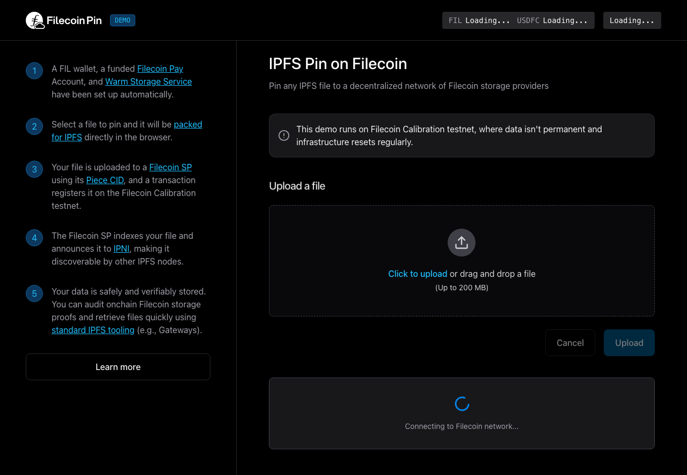

<h1 align="center">FilOzone</h1>

  Building Filecoin Onchain Cloud (FOC) infrastructure for building production-ready Filecoin applications.

  <a href="https://github.com/FilOzone/synapse-sdk">Synapse SDK</a> •
  <a href="https://github.com/FilOzone/filecoin-services">Filecoin Services</a> •
  <a href="https://github.com/FilOzone/filecoin-pay">Filecoin Pay</a> •
  <a href="https://github.com/FilOzone/pdp">PDP</a> •
  <a href="#featured-live-demos">Live Demos</a> •
  <a href="https://docs.filecoin.cloud/">Docs</a>

---

## Build with FOC

FilOzone provides the core building blocks for app developers and protocol teams:
- SDKs for integration
- Services for onchain workflows
- Payment rails for Filecoin-native apps
- Proof systems for data possession and verification

## Demo First: Start Building with FOC

1. Open a live demo and run through the workflow end-to-end.
2. Open the matching GitHub repo and fork it as your starter.
3. Swap in your own wallet/app logic using [synapse-sdk](https://github.com/FilOzone/synapse-sdk).
4. Move to production architecture with the services in the core stack below.

## Core Stack

| Project | What it is | Best for |
|---|---|---|
| [synapse-sdk](https://github.com/FilOzone/synapse-sdk) | JavaScript SDK for FOC integrations | App developers building quickly |
| [filecoin-services](https://github.com/FilOzone/filecoin-services) | Service and API layer for core workflows | Backend and platform teams |
| [filecoin-pay](https://github.com/FilOzone/filecoin-pay) | Payment and settlement primitives | Monetization and billing flows |
| [pdp](https://github.com/FilOzone/pdp) | Proof of Data Possession contracts and utilities | Verifiable storage workflows |

## Start Here

- New to FOC: begin with [synapse-sdk](https://github.com/FilOzone/synapse-sdk)
- Running local flows: [foc-devnet](https://github.com/FilOzone/foc-devnet)
- Exploring reference UIs:
  - [pdp-explorer](https://github.com/FilOzone/pdp-explorer)
  - [filecoin-pay-explorer](https://github.com/FilOzone/filecoin-pay-explorer)

## Featured Live Demos

<table>
  <tr>
    <td width="50%" valign="top">
      
      <h3>Filecoin Pin</h3>
      

        Decentralized IPFS pinning backed by Filecoin storage providers and onchain proofs.
        Use this demo to upload content, pin it, and understand the persistence model for production apps.
      

      

        <a href="https://pin.filecoin.cloud">Open Demo</a> •
        <a href="https://github.com/filecoin-project/filecoin-pin">GitHub</a>
      

    </td>
    <td width="50%" valign="top">
      
      <h3>FOC Upload dApp</h3>
      

        End-to-end starter dApp for upload and storage workflows with wallet auth, dataset management,
        and payment flows. Use it as a practical template for builder integrations on Filecoin Onchain Cloud.
      

      

        <a href="https://foc-demo.filbuilders.eth.limo">Open Demo</a> •
        <a href="https://github.com/FIL-Builders/foc-upload-dapp">GitHub</a>
      

    </td>
  </tr>
</table>

### Which Demo Should I Start With?

- Start with **Filecoin Pin** if you want IPFS-style pinning plus verifiable Filecoin persistence.
- Start with **FOC Upload dApp** if you want a full application scaffold for uploads, balances, and storage UX.

## Contributing

Issues and PRs are welcome across all repositories. For feature requests, open an issue in the closest matching repo and include your use case.
